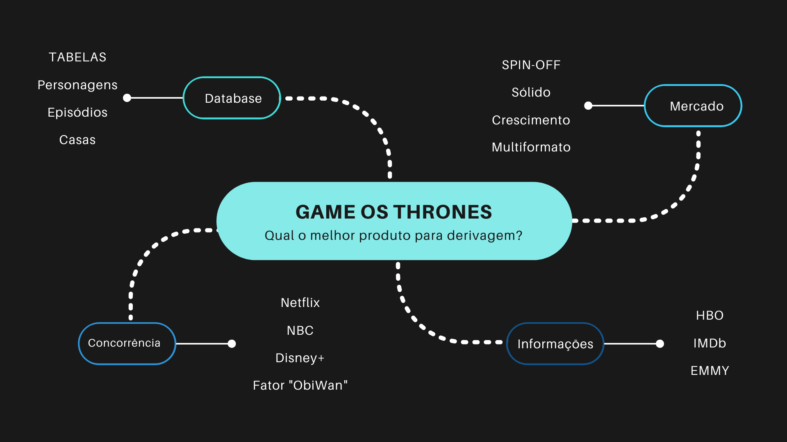
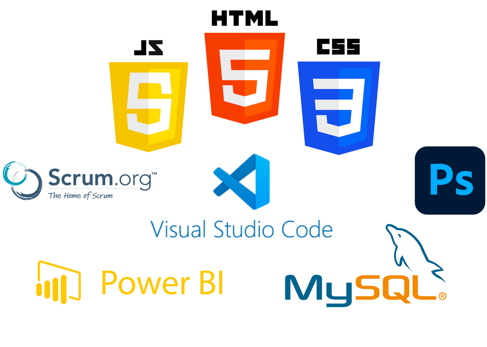

#   

# Módulo 03 - Projeto Final - Game of Spin-Off
 

 

## 🔖 Descrição:

Projeto de conclusão do Módulo 3 da <a href="https://www.resilia.com.br/">Resilia Educação</a>

O projeto teve como análise de banco de dados em CSV cruzando com informações do mercado para apresentar um estudo de viabilidade de produto de derivagem (spin-off) da série de televisão "Game of Thrones".

 Dados e informações utilizados no projeto: 
<ul style="list-style: square;">
    <li>Banco de dados principal composto de 3 tabelas: episódios, personagens e casas.
    <li>Coleta de dados e informações sobre o mercado de spin-off por meio pesquisa no cenário do entretenimento.</li>
    <li>Coleta de dados informações sobre os principais concorrentes (macros e micros) no mercado do spin-off.</li>
    <li>Coleta de dados e informações sobre elementos que estão diretamente ligados à produção da série Game of Thrones</li>    
</ul>

Foi utilizado SCRUM como metodologia ágil para a organização do projeto, com o uso da ferramenta Trello.

Para a demonstração detalhada das perguntas, gráficos e análises, foi desenvolvido um site em HTML, CSS e JavaScript, cujo protótipo foi desenvolvido no Photoshop.

 

## 📋 Brainstorming e perguntas norteadoras:

<ul style="list-style: square;">
    <li>O cálculo de tempo de duração dos episódios mostra se houve de fato uma redução de tempo de tela na narrativa nas duas últimas temporadas?</li>
    <li>O ápice de Game os Thrones foi na sexta temporada (levando em consideração o ápice da avaliação do público e as premiações)?</li>
    <li>Quiseram se aproveitar do fator suspense com a ameaça do "inverno está chegando" (nas sétima e oitava temporadas) para fazer o telespectador ficar até o final?</li>
    <li>Há uma comunicação entre a duração, a média de avaliações e o ibope de telespectadores americanaos para gerar um ranking dos episódios?</li>
    <li>Por que as duas últimas temporadas tiveram péssimas avaliações mas grande audiência?</li>
    <li>Um ranking das séries de tv preferidas do público nos tempos atuais mostra viabilidade do produto spin-off?</li>
    <li>Como inovar no próximo spin-off de Game of Thrones levando em consideração o banco de dados de episódios e personagens?</li>
    <li>Qual produto de streaming mostra-se como real concorrente da narrativa de Game of Thrones?</li>
    <li>Que episódio de Game of Thrones foi o mais indicado e\ou premiado?</li>
    <li>Que núcleo narrativo de Game of Thrones tem fluxo para sustentar temporada de spin-off?</li>
    <li>Há um episódio (ou dois ou três) que pela descrição consiga(m) resumir a narrativa para quem nunca assistiu a série?</li>
</ul>

 

## 📉 Algumas análises:

 
 

## 🛠️ Tecnologias e ferramentas utilizadas:

    
   

 

## 👥 Equipe:
| [ Anthony Thomas](https://github.com/anthonythom) |  [ Hugo Legramandi](https://github.com/hugolegramandi) |  [ Irena Costa](https://github.com/irenacosta) |
| :---: | :---: | :---: |
| [ Nando Mendes](https://github.com/nandomerces) |  [ Thainá Monteiro](https://github.com/Thaina-Monteiro) |

## ⚖️Licença
MIT License

Copyright (c), 2022. Equipe STUDIO DATA SCIENCE.

Permission is hereby granted, free of charge, to any person obtaining a copy of this software and associated documentation files (the "Software"), to deal
in the Software without restriction, including without limitation the rights to use, copy, modify, merge, publish, distribute, sublicense, and/or sell
copies of the Software, and to permit persons to whom the Software is furnished to do so, subject to the following conditions:

The above copyright notice and this permission notice shall be included in all copies or substantial portions of the Software.

THE SOFTWARE IS PROVIDED "AS IS", WITHOUT WARRANTY OF ANY KIND, EXPRESS OR IMPLIED, INCLUDING BUT NOT LIMITED TO THE WARRANTIES OF MERCHANTABILITY,
FITNESS FOR A PARTICULAR PURPOSE AND NONINFRINGEMENT. IN NO EVENT SHALL THE AUTHORS OR COPYRIGHT HOLDERS BE LIABLE FOR ANY CLAIM, DAMAGES OR OTHER
LIABILITY, WHETHER IN AN ACTION OF CONTRACT, TORT OR OTHERWISE, ARISING FROM, OUT OF OR IN CONNECTION WITH THE SOFTWARE OR THE USE OR OTHER DEALINGS IN THE
SOFTWARE.

 

