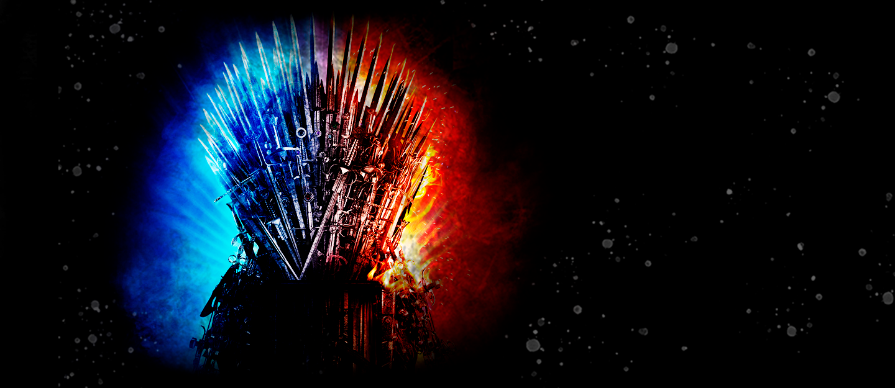

#  GOT Database

 

 

## 🔖 Descrição:

✨ Projeto de conclusão do Módulo 3 da <a href="https://www.resilia.com.br/">Resilia Educação</a> ✨

O projeto teve como objetivo a criação de um banco de dados MySQL para criar consultas e gráficos interpretativos sobre o tema. Para a análise de dados, foi utilizada a ferramenta Metabase.

Foi utilizado SCRUM como metodologia ágil para a organização do projeto, com o uso da ferramenta Trello.

Para a demonstração detalhada das perguntas, gráficos e análises, foi desenvolvido um site em HTML, CSS e JavaScript (ES6), cujo protótipo foi desenvolvido no Photoshop.

 

## 📋 Perguntas utilizadas:

<ul style="list-style: square;">
    <li>O cálculo de tempo de duração dos episódios mostra se houve de fato uma redução de tempo de tela na narrativa nas duas últimas temporadas?</li>
    <li>O ápice de Game os Thrones foi na sexta temporada (levando em consideração o ápice da avaliação do público e as premiações)?</li>
    <li>Quiseram se aproveitar do fator suspense com a ameaça do "inverno está chegando" (nas sétima e oitava temporadas) para fazer o telespectador ficar até o final?</li>
    <li>Há uma comunicação entre a duração, a média de avaliações e o ibope de telespectadores americanaos para gerar um ranking dos episódios?</li>
    <li>Por que as duas últimas temporadas tiveram péssimas avaliações mas grande audiência?</li>
    <li>Um ranking das séries de tv preferidas do público nos tempos atuais mostra viabilidade do produto spin-off?</li>
    <li>Como inovar no próximo spin-off de Game of Thrones levando em consideração o banco de dados de episódios e personagens?</li>
    <li>Qual produto de streaming mostra-se como real concorrente da narrativa de Game of Thrones?</li>
    <li>Que episódio de Game of Thrones foi o mais indicado e\ou premiado?</li>
    <li>Que núcleo narrativo de Game of Thrones tem fluxo para sustentar temporada de spin-off?</li>
    <li>Há um episódio (ou dois ou três) que pela descrição consiga(m) resumir a narrativa para quem nunca assistiu a série?</li>
</ul>

 

## 📉 Algumas análises:

 

 

## 🛠️ Tecnologias e ferramentas utilizadas:

 

## 👥 Equipe:

 

